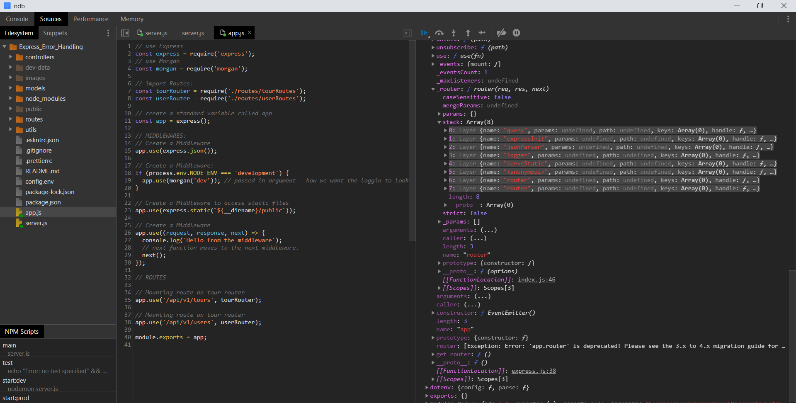
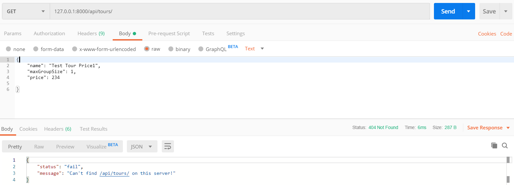

# Express_Error_Handling
---  
## Debugging Node.js with ndb (GoogleChromeLabs/ndb)
- install - ```npm i ndb --global```  
- add a new script to package.json - ```"debug": "ndb server.js"```  
- run the app in the terminal - ```> npm run debug```; a new Chrome window will open. 
- Here we can examin how the application works by looking into the app variable(the express application that we export from app.js) 
  - _router: - stack: - this is the *Middleware Stack in our application*.  
    
- The Global variable holds the process: - env: variable; this is where the *environment variables are stored.*  
---  
## Handling Unhandled Routes  
- Defining handler function for undefined routes.  
- Open up ***app.js*** - the definition for our Express Application.  
  Recap that the middleware functions are executed in the order they are in code; which means that if the execution passes all routes top-down there is no route for that request. Add a middleware that handles this unhandled request.  
```JavaScript
// use Express
const express = require('express');
// use Morgan
const morgan = require('morgan');

// import Routes:
const tourRouter = require('./routes/tourRoutes');
const userRouter = require('./routes/userRoutes');

// standard variable called app
const app = express();


// *** MIDDLEWARES: ***

app.use(express.json());

if (process.env.NODE_ENV === 'development') {
  app.use(morgan('dev'));
}

// Middleware to access static files
app.use(express.static(`${__dirname}/public`));


// *** ROUTES: ***

app.use('/api/v1/tours', tourRouter);
app.use('/api/v1/users', userRouter);

// implement a route handler that was not catched:
app.all('*', (req, res, next) => {
  res.status(404).json({
    status: 'fail',
    message: `Can't find ${req.originalUrl} on this server!`
  });
});

module.exports = app;
```  
Test the application in Postman - we should get a JSON error message back:  
  
<br/>

## Implementing a Global Error Handling Middleware
